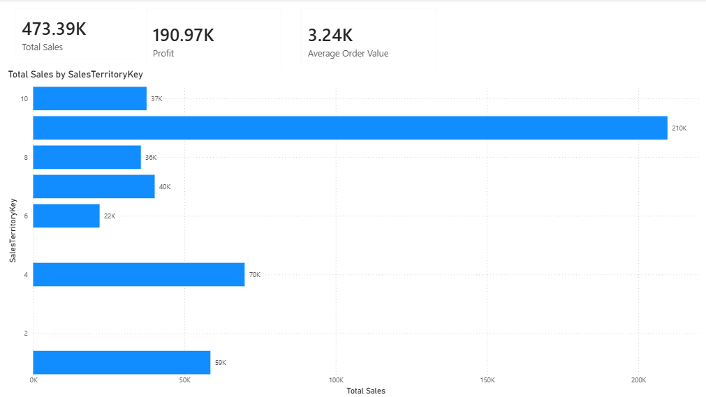
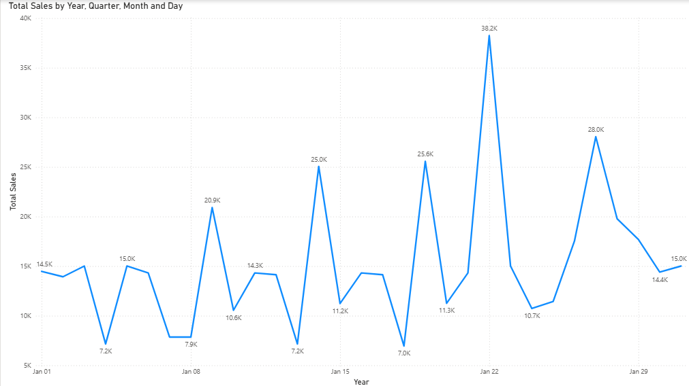
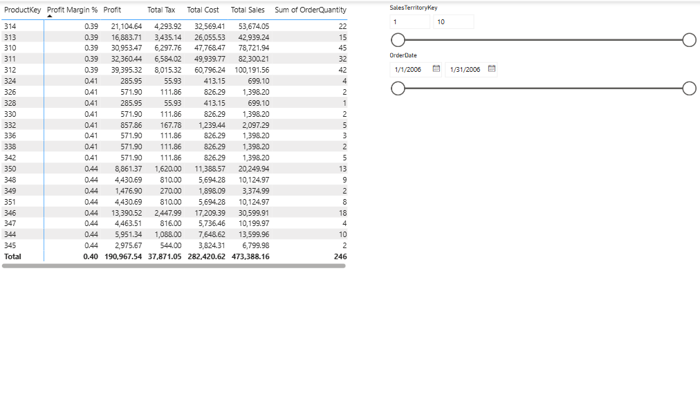

# AdventureWorks-Sales-Dashboard
Power BI Sales Dashboard for AdventureWorks dataset
# AdventureWorks Sales Dashboard (Power BI)

An interactive Power BI Dashboard designed to analyze and visualize the sales performance of AdventureWorks. This project transforms raw retail data into actionable business insights.

## 📊 Key Features & Insights
* **Sales Performance:** Track and analyze key sales metrics, revenue trends, and profit margins over time.
* **Product Analytics:** Identify top-performing products, categories, and inventory movement.
* **Customer Segmentation:** Understand customer demographics and purchasing behaviors.
* **Geographical Analysis:** Visual representation of sales distribution across different territories.

## 📷 Dashboard Screenshots
Here is a preview of the interactive dashboard:

### 1. Sales Performance Overview

### 2. Total Sales Trends

### 3. Product Performance & Profit Margins

## 🛠️ Tools & Technologies Used
* **Power BI Desktop:** For data modeling, DAX calculations, and report visualization.
* **Power Query:** Used for ETL (Extract, Transform, Load) processes, cleaning, and structuring the raw data.
* **CSV Data Source:** Utilizing the AdventureWorks dataset (`200601.csv`).

## 📁 Repository Structure
* `/200601.csv`: Contains raw and processed CSV datasets.
* `AdventureWorks_Sales_Dashboard.pbix.pbix`: The main Power BI project file (feel free to download and explore).

---
*Created by [Fərid Əhmədov](https://github.com/feridehmedovv200)*
